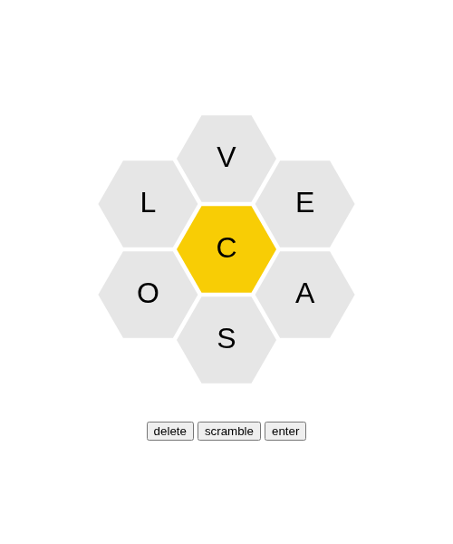

# Spelling Bee 🐝

A NYT Spelling Bee clone built with TypeScript. Build as many words as you can using the 7 letters arranged in a honeycomb — but every word must include the center letter!

## 🎮 Live Demo

Play the game at: **https://domfurano.github.io/spelling-bee/**

## Game Overview

The board consists of seven hexagonal tiles arranged in a honeycomb pattern. Six letters surround a golden center tile. Your goal is to find words that:

- Use **only** the seven available letters
- **Always include** the center (golden) letter
- Are at least **4 letters** long

### Controls

| Button | Action |
|--------|--------|
| Click a hexagon | Add that letter to your current word |
| **Delete** | Remove the last letter from your current word |
| **Scramble** | Shuffle the outer letters for a fresh perspective |
| **Enter** | Submit your current word |

## Screenshots



*Seven letters arranged in a honeycomb — click to build words!*

## Tech Stack

| Layer | Technology |
|-------|-----------|
| Language | [TypeScript](https://www.typescriptlang.org/) |
| Rendering | HTML5 Canvas |
| Game Engine | [@mesa-engine/core](https://www.npmjs.com/package/@mesa-engine/core) (Entity Component System) |
| Bundler | [Vite](https://vitejs.dev/) |
| Testing | [Vitest](https://vitest.dev/) |
| Linting | [ESLint](https://eslint.org/) + [@typescript-eslint](https://typescript-eslint.io/) |
| Formatting | [Prettier](https://prettier.io/) |

## Prerequisites

- [Node.js](https://nodejs.org/) v18 or higher
- npm (included with Node.js)

## Installation

```bash
# Clone the repository
git clone https://github.com/domfurano/spelling-bee.git
cd spelling-bee

# Install dependencies
npm install
```

## 🚀 Running Locally

Start a development server with hot reload:

```bash
npm run dev
```

## 🏗️ Build

Build for production (output goes to `dist/`):

```bash
npm run build
```

## 🧪 Running Tests

```bash
npm test
```

## 🛠️ Code Quality

```bash
# Lint code
npm run lint

# Fix linting issues automatically
npm run lint:fix

# Format code
npm run format

# Check code formatting
npm run format:check
```

## Project Structure

```
spelling-bee/
├── src/
│   ├── blueprints/          # Entity blueprints (hexagon, button, candidate answer)
│   ├── components/          # ECS components (position, render, text, input, …)
│   ├── model/               # Data models (Point)
│   ├── systems/             # ECS systems (render, interaction, scene creation, …)
│   ├── index.html           # HTML entry point
│   ├── index.ts             # Application bootstrap
│   └── styles.css           # Global styles
├── dist/                    # Pre-built production output
├── test/                    # Unit tests
└── package.json
```

## License

See [LICENSE](LICENSE).
